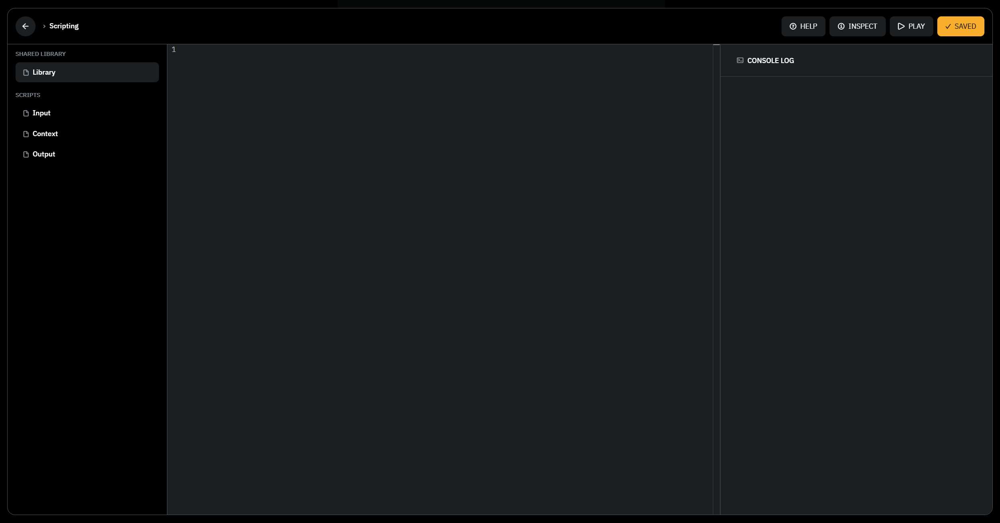
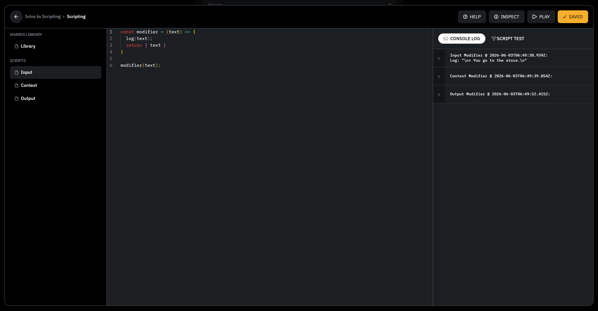
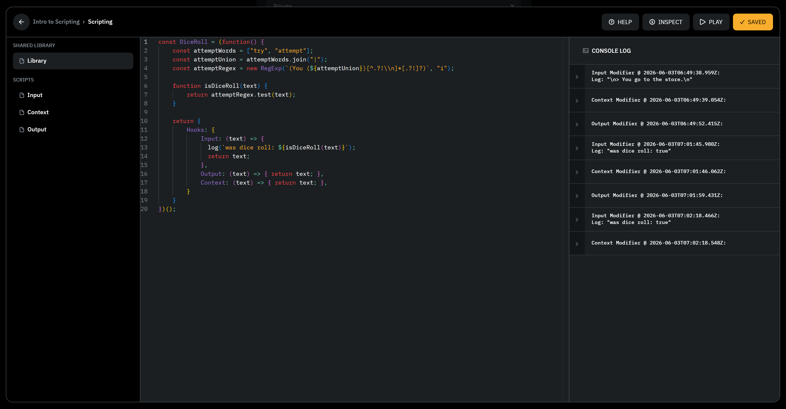
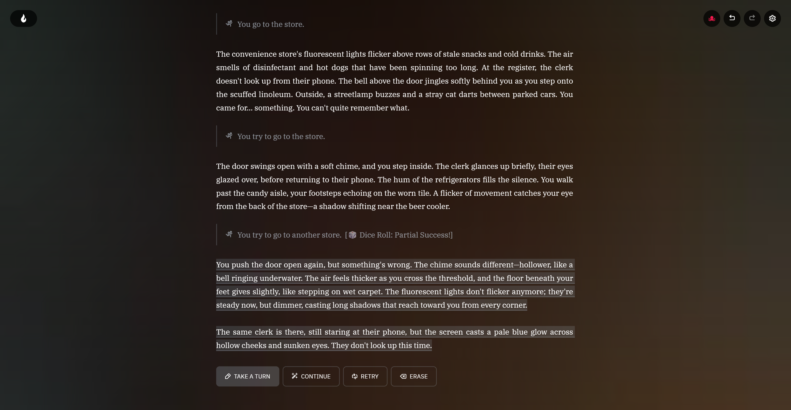

## What is AI Dungeon?

AI Dungeon is a text-based roleplaying game that allows you to create and play
scenarios using AI to narrate your adventures. I'm assuming you already know
what it is and how it works if you're interested in scripting.

## What is AI Dungeon Scripting?

Scripting provides you a way to take more control over your AI Dungeon
experience. In particular, you can interact in three ways:

- Read and modify player inputs
- Read and modify AI outputs
- Read and (sometimes) modify AI context

These three let you control basically your entire experience, and these are
super powerful. If you've ever seen the (🎭IS) marker on a scenario, that's
using scripting.

Scripts range from simple to complex. LewdLeah's Inner Self uses scripts to
simulate thought in NPCs using prompt injection. LewdLeah's Auto Cards uses
scripts to automatically create story cards based on your story's contents.
PoisonTea's Dice Roll Script uses scripting to automatically roll dice when you
"try" an action.

## How do I get started?

You'll want to know a little bit of JavaScript, or to be comfortable with vibe
coding, knowing how to copy things around and test them thoroughly. There are
some project setups that can help AI work more effectively with scripts, but for
the purposes of this guide I'm going to keep things simple.

We'll start in the scripting UI, which looks like this:



Along the left side are the four script tabs. "Shared Library" has the 
"Library" script file, and "Scripts" contains each of the modifier scripts:
Input, Output, and Context. "Shared Library" is the spot where most of our
code tends to go, since it's shared between the other three tabs.

We also have the Help, Inspect, Play, and Save buttons along the top, and the
Console Log and Script Test on the left side. Help will take you to the
scripting documentation, inspect does nothing as far as I can see, play will
take you to the scenario page, and save will save your scripts to the scenario.

:::tip[Script Test]
Quite honestly, the Script Test button isn't very useful for us. It's generally
much better practice to be working on scripts in one tab, and running your
scenario in another tab. You can use the `log` function anywhere in the scripts
to print messages to the Console Log.
:::

## Hook Types

The three spots you can get involved in the platform's behavior are called
hooks. Input, Output, and Context each do something different and are useful
in different ways.

### Input Hook

The input hook is used to read and modify the player's input. The dice roll
script I mentioned earlier uses this to look for "try" or similar words in 
the player's input, and add a dice roll result to the end of it. For
non-continue player actions, this is the hook that runs first.

### Context Hook

Next in the execution process is the context hook. This runs every turn _before_
the AI does anything, and determines what the AI sees. 

:::warn[Cache Efficient Models]
The context hook is available on cache efficient models (or models with cache
efficiency enabled), however it does not read the result of this hook. That 
means the context can be _read_, but not _modified_ on those models which means
scripts that rely on sending specific context to the AI will not work on these
models.
:::

This hook is super useful for collecting information about the story's contents
and on compatible models, it can be used to give the AI specific instructions
on how to behave. This is what enables cards like LewdLeah's Inner Self and
Auto Cards; an instruction is added to tell the AI to describe a concept in the
story (for Auto Cards) and loops until enough content is in the card, or the AI
is told to pretend to be a character and inject thoughts in a specific format
(for Inner Self).

### Output Hook

While the Context hook is the most useful for giving the AI instructions,
correcting its output can be useful as well. That's what the Output hook is for.
Some scenarios use this to entirely overwrite the AI's output with a specific
message, like to present stat blocks. Several people use this to write scripts
that enforce specific rules, like proper line breaks, or replacing cliche
names with more diverse ones.

## Global State

Scripts work on a couple pieces of effectively global state which can be used
to access nearly everything about the story and the adventure.  A more full view
of these can be found [here][aidts], which also conveniently can
be passed to an LLM to make it more effective at working with scripts.

### `text`

The text sent to the current hook. In an Input hook, this is the player's input.
In an Output hook, this is the AI's output. In a Context hook, this is the
context that the AI will see.

Note, this is after any processing. So for example, if I type "I go to the
store" as a Do action, the text will be processed into second or third person
to say "You go to the store" _before_ it's passed to the script.

### `history`   

The history of the story so far, including the turn's text and the type. The
`type` can be one of `start`, `continue`, `do`, `say`, `story`, or `see`. These
match with their corresponding player actions, except for `start` which is the
initial story start.

### `storyCards`

The story cards in the adventure.

### `state`

Persistent information, as well as `memory` which allows you to access the Plot
Essentials (`state.memory.context`), Author's Note (`state.memory.authorsNote`),
and `frontMemory` which is added to the very end of the context.

### `info`

Contains some basic information about the adventure:
- `characterNames` for the characters in a multiplayer adventure
- `actionCount` to track the number of actions taken


In the Context hook, it also includes:
- `maxChars`, an estimate of how long the context is allowed to be
- `memoryLength` which is the number of characters in the model context from 
  `state.memory`
- `useCacheEfficient` which is a boolean indicating whether the model is cache 
  efficient
- `storyModel` which is information about the model currently being used, like
  `name` and `version`.


## Provided Functions

Some functions are also provided by default to help with scripting. These are
`addStoryCard`, `removeStoryCard`, `log`, and `updateStoryCard`. Here are what
these look like, as extracted from the scripting sandbox:

### addStoryCard

Adds a new story card to the adventure.

Creates a card with a random ID and pushes it to the storyCards array.  The card
will be triggered when its keys match content in the recent story.  The `entry`
field is what gets injected into the "World Lore" section of context.

```javascript
function addStoryCard(
  keys, 
  entry, 
  type = 'Custom', 
  name = keys, 
  notes = '', 
  options
) {
  const { returnCard = false } = options ?? {};
  storyCards.push({
    id: Math.floor(Math.random() * 1000000000).toString(),
    keys,
    entry,
    type,
    title: name,
    description: notes
  });
  if (returnCard) {
    return storyCards[storyCards.length - 1];
  } else {
    return storyCards.length;
  }
}
```

### removeStoryCard

Removes a story card from the adventure.

Uses splice to remove the card at the specified index.  Throws an error if the
card doesn't exist at the specified index.  Use with caution as indices may
shift when cards are added/removed.

```javascript
function removeStoryCard(index) {
  if (storyCards[index]) {
    storyCards.splice(index, 1);
  } else {
    throw new Error(
      `Story card not found at index ${index} in removeStoryCard`
    );
  }
}
```

### updateStoryCard

Updates an existing story card. Replaces the card at the specified index while
preserving the id. Optional parameters (type, name notes) preserve existing
values if not provided. Throws an error if the card does not exist at the
specified index.

```javascript
function updateStoryCard(index, keys, entry, type, name, notes) {
  const existing = storyCards[index]
  if (existing) {
    storyCards[index] = {
      id: existing.id,
      keys,
      entry,
      type: type ?? existing.type,
      title: name ?? existing.title,
      description: notes ?? existing.description
    }
  } else {
    throw new Error(
      `Story card not found at index ${index} in updateStoryCard`
    )
  }
}
```

## The Modifier Function

Okay, that's a lot about the information that hooks have available. Let's take a
look at where we use that information. 

Hooks work on the idea of a modifier function. It takes in some state, and
mutates that state. For example, one way of writing the modifier function looks
like this:

```javascript
// Simple no-op modifier function
const modifier = ({ text }) => {
    text = text + " [Modified Content]";
    return { text };
}

modifier(text);
```

This modifier function takes in the text state, and returns the modified text
state. This one is pretty simple, but it's nice because it captures the text as
a part of its function context, so doesn't risk accidentally modifying the
global text. We intentionally tell it to do that by calling `modifier(text)` at
the end.

You'll also sometimes see ones like this, that modify the text state as a side
effect of the function. This is a bit more dangerous, but makes sense for 
heavy scripts like `InnerSelf` that do a lot of work, and want to run before
anything else.

```javascript
// In shared library
const Modifier = (hook) => {
    if (hook === "input") {
        text = text + " [Modified Content]";
    }
}

// In input script:
Modifier("input");
```

## A Worked Example

Let's take a look at a worked example of a script. This one will be super
simple, one based on PoisonTea's Dice Roll Script. First, we'll want to
add some details to the Shared Library. We'll start by creating a function that
captures all of the details of the script. This isn't required, but it helps
the script to play nice with other scripts and not risk clobbering other
scripts' hooks or internal state.

```javascript
const DiceRoll = (function() {
    return {
        Hooks: {
            Input: (text) => { return text; },
            Output: (text) => { return text; },
            Context: (text) => { return text; },
        }
    }
}
```

:::tip
You may need to reload the scenario editing page to get console logs to show up,
and make sure that scripts are enabled on your scenario, and profile. Depending
on what your script is doing, you may need to enable dangerous scripts as well.
:::

Next, let's add a function to detect if the player is trying to do something.
The way I'd do this is to first open up the Input hook, and log what we get
when the player does something.

```javascript
// In the Input tab
const modifier = ({ text }) => {
    log(text);
    return { text };
}

modifier(text);
```

I'll also open up the adventure in another tab and run an action like "I go to
the store". Then I'll check the console output and see what we get:




So, it looks like we get this:

```text
\n> You go to the store.\n
```

That means a couple things. I probably want to look for "You try" or "You
attempt" at the beginning of the text. So let me write a function that does that
in my script, and log the result to the console:

```javascript focus={2-7,15-18} ins={2-7,15-18}
const DiceRoll = (function() {
    const attemptWords = ["try", "attempt"];
    const attemptUnion = attemptWords.join("|");
    const attemptRegex = new RegExp(
      `> (You (${attemptUnion})[^.?!\\n]*[.?!]?)`, 
      "i"
    );

    function isDiceRoll(text) {
        return attemptRegex.test(text);
    }

    return {
        Hooks: {
            Input: (text) => { 
              log(`was dice roll: ${isDiceRoll(text)}`);
              return text; 
            },
            Output: (text) => { return text; },
            Context: (text) => { return text; },
        }
    }
})();
```

Now I'll hook this up in the Input script:
```javascript
// In the Input tab
const modifier = ({ text }) => {
  text = DiceRoll.Hooks.Input(text);
  return { text };
}

modifier(text);
```

And give this a try by running an action like "I try to go to the store", then
checking the console output:



So, it looks like we get this:

```text
was dice roll: true
```

That means our function worked! Now, let's add a function to roll the dice and
add the result to the end of the text. We'll use a simple function that rolls a
dice and returns the result.

```javascript focus={13-25,29-35} ins={13-25,31-33} del={30}
const DiceRoll = (function() {
    const attemptWords = ["try", "attempt"];
    const attemptUnion = attemptWords.join("|");
    const attemptRegex = new RegExp(
      `> (You (${attemptUnion})[^.?!\\n]*[.?!]?)`, 
      "i"
    );

    function isDiceRoll(text) {
        return attemptRegex.test(text);
    }

    function getRollResult() {
      const result = (Math.floor(Math.random() * 20) + 1);
      if (result == 20) {
        return "Critical Success!";
      }
      if (result >= 10) {
        return "Success!";
      }
      if (result >= 5) {
        return "Partial Success!";
      }
      return "Failure!";
    }

    return {
        Hooks: {
            Input: (text) => { 
              log(`was dice roll: ${isDiceRoll(text)}`);
              if (isDiceRoll(text)) { 
                return text + ` [🎲 Dice Roll: ${getRollResult()}]`;
              }
              return text;
            },
            Output: (text) => { return text; },
            Context: (text) => { return text; },
        }
    }
})();
```

Let's give this a test by running an action like "I try to go to the store",
then seeing if we get anything added onto that action.



So, it looks like we get this:

```text
You try to go to the store. [🎲 Dice Roll: Partial Success!]
```

This is just touching the surface of what you can do with scripting. In my
next post, I'd like to cover using story cards to configure your script's
behavior by adding modifier words to this script. If this was useful to you
please let me know! I'm `worldsmythe_` on the 
[AI Dungeon Discord](https://discord.com/invite/HB2YBZYjyf).

[aidts]: https://github.com/Worldsmythe/FoxTweaks/blob/54cf86b3f34406a7f4c4293b4dc0267ebdf3d443/src/aidungeon.d.ts